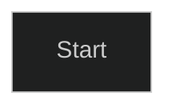
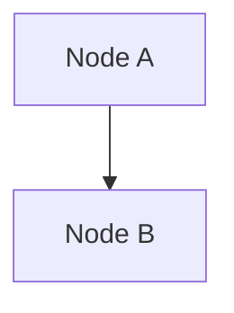
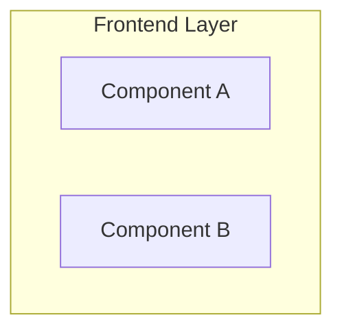

# 📊 SyncUp UML Diagrams - Complete User Guide

## 🎯 Quick Start

### Option 1: View Diagrams Immediately (No Installation)
1. Go to https://mermaid.live
2. Copy content from any `.mmd` file in this folder
3. Paste into the editor
4. Diagrams render instantly

### Option 2: View in VS Code (Recommended)
1. Install extension: `bierner.markdown-mermaid`
2. Open any `.mmd` file in VS Code
3. Press `Ctrl+Shift+V` to preview

### Option 3: Generate PNG/SVG Images
```bash
# Linux/Mac
chmod +x convert-to-images.sh
./convert-to-images.sh

# Windows
convert-to-images.bat
```

---

## 📁 Folder Structure

```
docs/uml/
├── *.mmd                        ← 13 editable diagram files
├── png/                         ← Generated PNG images (after conversion)
├── svg/                         ← Generated SVG images (after conversion)
├── README.md                    ← Full documentation
├── INDEX.md                     ← Quick reference with previews
├── GUIDE.md                     ← This file
├── convert-to-images.sh         ← Linux/Mac conversion script
└── convert-to-images.bat        ← Windows conversion script
```

---

## 📊 The 13 Diagrams

| # | Name | File | Type | Best For |
|---|------|------|------|----------|
| 1 | System Architecture | `01-system-architecture.mmd` | Component | Understanding overall system |
| 2 | Authentication Login | `02-authentication-login.mmd` | Sequence | Learning JWT flow |
| 3 | Status Update Real-time | `03-status-update-realtime.mmd` | Sequence | Understanding real-time updates |
| 4 | Team Management | `04-team-management.mmd` | Sequence | Team operations |
| 5 | Team Dashboard | `05-team-dashboard.mmd` | Sequence | Dashboard with live updates |
| 6 | Domain Model | `06-domain-model.mmd` | Class | Database design |
| 7 | User Journey | `07-user-journey.mmd` | Activity | User workflows |
| 8 | Data Flow | `08-data-flow.mmd` | Data Flow | End-to-end data transformation |
| 9 | Deployment Architecture | `09-deployment-architecture.mmd` | Deployment | Docker setup |
| 10 | JWT Security | `10-jwt-security.mmd` | Sequence | Security implementation |
| 11 | WebSocket Messages | `11-websocket-messages.mmd` | Sequence | Real-time messaging |
| 12 | Error Handling | `12-error-handling.mmd` | Activity | Error flows |
| 13 | Frontend Components | `13-frontend-components.mmd` | Component | React architecture |

---

## 🔧 Installation & Setup

### Prerequisites
- **Node.js** 14+ (for mermaid-cli)
- **npm** or **yarn**

### Install mermaid-cli (Optional, for image generation)

```bash
# Global installation
npm install -g @mermaid-js/mermaid-cli

# Or local installation in project
npm install --save-dev @mermaid-js/mermaid-cli
```

### VS Code Setup (Recommended)

1. Install extensions:
   - `bierner.markdown-mermaid` - Preview mermaid diagrams
   - `bpruitt-goddard.mermaid-markdown-syntax-highlighting` - Syntax highlighting

2. Open any `.mmd` file in VS Code

3. Preview:
   - Press `Ctrl+Shift+V` (Windows/Linux) or `Cmd+Shift+V` (Mac)
   - Or click preview icon in top-right

---

## 🖼️ Viewing Diagrams

### Method 1: Mermaid Live Editor
**Best for**: Quick viewing, sharing, exporting

```
1. Visit https://mermaid.live
2. Paste `.mmd` file content
3. Adjust diagram
4. Download as PNG/SVG/PDF
```

### Method 2: VS Code (Recommended)
**Best for**: Development, editing, version control

```
1. Install markdown-mermaid extension
2. Open `.mmd` file
3. Press Ctrl+Shift+V
4. Edit live
```

### Method 3: GitHub
**Best for**: Documentation, sharing

```
1. Commit `.mmd` files to git
2. GitHub renders them automatically
3. View in pull requests, issues
```

### Method 4: Browser with Extension
**Best for**: Quick preview anywhere

- Install "Mermaid Viewer" extension
- Visit files containing Mermaid code
- Renders automatically

---

## 🖨️ Converting to Images

### Automatic Conversion (Easiest)

**Linux/Mac:**
```bash
cd docs/uml
chmod +x convert-to-images.sh
./convert-to-images.sh
```

**Windows:**
```cmd
cd docs\uml
convert-to-images.bat
```

### Manual Conversion (Single File)

**PNG:**
```bash
mmdc -i 01-system-architecture.mmd -o 01-system-architecture.png
```

**SVG:**
```bash
mmdc -i 01-system-architecture.mmd -o 01-system-architecture.svg
```

**With Options:**
```bash
# High resolution PNG (2x)
mmdc -i input.mmd -o output.png -s 2

# SVG with white background
mmdc -i input.mmd -o output.svg -b white

# PDF
mmdc -i input.mmd -o output.pdf
```

### Using Docker

```bash
docker run -v $(pwd)/docs/uml:/data \
  mermaid-cli \
  mmdc -i /data/01-system-architecture.mmd \
  -o /data/01-system-architecture.png
```

### Batch Conversion Script

Create `convert-all.sh`:
```bash
#!/bin/bash
for file in *.mmd; do
    mmdc -i "$file" -o "${file%.mmd}.png"
    mmdc -i "$file" -o "${file%.mmd}.svg"
done
chmod +x convert-all.sh
./convert-all.sh
```

---

## ✏️ Editing Diagrams

### Quick Edits

**Change a label:**
```mermaid
# Before
NodeName["Old Label"]

# After
NodeName["New Label"]
```

**Change colors:**
```mermaid
style NodeName fill:#e3f2fd,color:#fff
```

**Add/remove connections:**
```mermaid
# Add connection
NodeA --> NodeB

# Remove by deleting the line
```

**Change diagram type:**
- Sequence: `sequenceDiagram`
- Component: `graph TB`
- Class: `classDiagram`
- Activity: `graph TD`

### Edit in Mermaid Live

1. Go to https://mermaid.live
2. Paste diagram content
3. Edit directly in editor
4. See changes instantly
5. Export modified diagram
6. Save as `.mmd` file locally

### Edit in VS Code

1. Open `.mmd` file
2. Edit syntax
3. Preview updates in real-time
4. Save file
5. Changes persist

---

## 📚 Common Tasks

### Embedding in Documentation

**Markdown:**
```markdown


Or with link:

[](docs/uml/01-system-architecture.mmd)
```

**HTML:**
```html

```

### Adding to README.md

```markdown
## System Architecture

[View Editable Diagram](docs/uml/01-system-architecture.mmd)


See [UML Diagrams](docs/uml/) for all 13 diagrams.
```

### Creating Presentation Slides

1. Convert diagrams to PNG/SVG
2. Insert into PowerPoint/Google Slides
3. Adjust size/position
4. Add notes/descriptions

### CI/CD Integration

**GitHub Actions:**
```yaml
- name: Convert Mermaid to PNG
  run: |
    npm install -g @mermaid-js/mermaid-cli
    for file in docs/uml/*.mmd; do
      mmdc -i "$file" -o "docs/uml/png/$(basename $file .mmd).png"
    done
```

---

## 🎯 Understanding Each Diagram

### 1. System Architecture (01)
- **Shows**: All major components and their connections
- **Read**: From left to right, understanding data flow
- **Use**: Architecture reviews, onboarding

### 2. Authentication Login (02)
- **Shows**: Step-by-step login process
- **Read**: Top to bottom, following participant interactions
- **Use**: Security understanding, API design

### 3. Status Update Real-time (03)
- **Shows**: Status change and real-time broadcast
- **Read**: From top, see how changes propagate
- **Use**: Real-time feature understanding

### 4. Team Management (04)
- **Shows**: Team CRUD operations
- **Read**: Follow user actions to database operations
- **Use**: API endpoint understanding

### 5. Team Dashboard (05)
- **Shows**: Dashboard loading with caching and live updates
- **Read**: Cache hit/miss paths, then live update loop
- **Use**: Performance optimization understanding

### 6. Domain Model (06)
- **Shows**: Database entities and relationships
- **Read**: Look for connections and cardinality (1:1, 1:N)
- **Use**: Database design review, migration planning

### 7. User Journey (07)
- **Shows**: Complete user workflow
- **Read**: Follow paths from start to end
- **Use**: User experience review, feature planning

### 8. Data Flow (08)
- **Shows**: Data transformation through layers
- **Read**: Left to right, through each layer
- **Use**: Performance analysis, debugging

### 9. Deployment Architecture (09)
- **Shows**: Container and infrastructure setup
- **Read**: Understand container relationships
- **Use**: Deployment planning, troubleshooting

### 10. JWT Security (10)
- **Shows**: Token generation, validation, and usage
- **Read**: Three main steps: generation, using token, WebSocket
- **Use**: Security implementation, auditing

### 11. WebSocket Messages (11)
- **Shows**: Real-time message flow via STOMP
- **Read**: Connection, subscription, messages, disconnection
- **Use**: Real-time debugging, optimization

### 12. Error Handling (12)
- **Shows**: Exception paths and HTTP status codes
- **Read**: See all possible error scenarios
- **Use**: API error handling, testing

### 13. Frontend Components (13)
- **Shows**: React component hierarchy and dependencies
- **Read**: See parent-child relationships
- **Use**: Component architecture review, refactoring

---

## 🔄 Maintenance

### When to Update Diagrams

- ✅ Architecture changes
- ✅ New features added
- ✅ Database schema changes
- ✅ API endpoints modified
- ✅ Security updates
- ✅ Infrastructure changes

### Best Practices

1. **Keep `.mmd` as source of truth**
   - Version control `.mmd` files
   - Regenerate images from `.mmd`

2. **Update together with code**
   - If code changes, update diagrams
   - Include in code review

3. **Add comments**
   - Document changes in `.mmd` files
   - Use git commit messages

4. **Version diagrams**
   - Tag releases with diagram versions
   - Keep history of changes

5. **Regenerate regularly**
   - Run conversion script quarterly
   - Ensure images match `.mmd` files

---

## 🆘 Troubleshooting

### Issue: Diagram Not Rendering

**Solution:**
```bash
# Validate Mermaid syntax
# Option 1: Online validator
# Go to https://mermaid.live and paste content

# Option 2: Check common errors
# - Missing colons after flowchart type
# - Unclosed quotes
# - Invalid characters
# - Wrong connector syntax
```

### Issue: mermaid-cli Not Found

**Solution:**
```bash
# Install globally
npm install -g @mermaid-js/mermaid-cli

# Or use npx
npx @mermaid-js/mermaid-cli -i input.mmd -o output.png

# Check installation
mmdc --version
```

### Issue: SVG/PNG Not Generated

**Solution:**
```bash
# Try with explicit format
mmdc -i diagram.mmd -o diagram.png

# Check file permissions
ls -la diagram.mmd

# Try verbose mode
mmdc -i diagram.mmd -o diagram.png -v
```

### Issue: Colors Not Working

**Solution:**
```mermaid
# Use valid hex colors
style NodeName fill:#e3f2fd    # Valid
style NodeName fill:blue       # May not work

# Use proper syntax
style Node1 fill:#e3f2fd,stroke:#333,color:#000
```

---

## 📖 Learning Resources

### Mermaid Documentation
- Official Docs: https://mermaid.js.org
- Flowchart Guide: https://mermaid.js.org/syntax/flowchart.html
- Sequence Guide: https://mermaid.js.org/syntax/sequenceDiagram.html
- Class Guide: https://mermaid.js.org/syntax/classDiagram.html

### UML Standards
- Official UML: https://www.uml.org
- UML Diagrams: https://www.visual-paradigm.com/guide/uml-unified-modeling-language/uml-diagram-types/

### System Design
- System Design Primer: https://github.com/donnemartin/system-design-primer
- AWS Architecture Icons: https://aws.amazon.com/architecture/icons/

---

## 💡 Tips & Tricks

### Tip 1: Use Variables


### Tip 2: Add Comments


### Tip 3: Subgraphs for Organization


### Tip 4: Styling Groups
```mermaid
style A fill:#e3f2fd
style B fill:#f3e5f5
style C fill:#e8f5e9
```

### Tip 5: Export Options
```bash
# Different resolutions
mmdc -i diagram.mmd -o output.png -s 1  # 1x
mmdc -i diagram.mmd -o output.png -s 2  # 2x (High DPI)
mmdc -i diagram.mmd -o output.png -s 3  # 3x (Very High DPI)
```

---

## 📞 Support

### Getting Help

1. **Mermaid Community**: https://github.com/mermaid-js/mermaid/discussions
2. **Stack Overflow**: Tag `mermaid` or `mermaid-js`
3. **GitHub Issues**: https://github.com/mermaid-js/mermaid/issues

### Report Issues

If you find diagram issues:
1. Edit the `.mmd` file
2. Create PR with changes
3. Include screenshot/explanation
4. Regenerate images

---

## ✅ Checklist for Using Diagrams

- [ ] Installed mermaid-cli (optional)
- [ ] Installed VS Code extension for preview
- [ ] Viewed at least one diagram
- [ ] Tested editing a diagram
- [ ] Generated PNG/SVG images
- [ ] Embedded diagram in documentation
- [ ] Bookmarked https://mermaid.live
- [ ] Added diagrams to README.md
- [ ] Shared with team

---

**Last Updated**: May 13, 2024  
**Mermaid Version**: v10+  
**Project**: SyncUp - Smart Hybrid Workplace Presence Platform

---

## 🚀 Next Steps

1. **Explore the diagrams** - Start with `INDEX.md` for previews
2. **Edit in VS Code** - Try modifying a diagram
3. **Generate images** - Run the conversion script
4. **Share with team** - Embed in documentation
5. **Keep updated** - Maintain as project evolves
