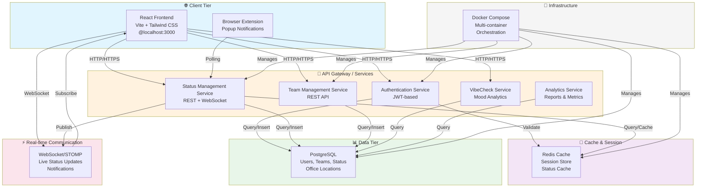

# UML Diagrams Index

Quick reference to view all 13 SyncUp UML diagrams.

## 📊 All Diagrams

### 1. System Architecture & Components
**File**: `01-system-architecture.mmd`  
**Type**: Component Diagram  
**Purpose**: High-level overview of all system components and interactions



---

### 2. Authentication & Login
**File**: `02-authentication-login.mmd`  
**Type**: Sequence Diagram  
**Purpose**: JWT token generation and login flow

[View in editor: `02-authentication-login.mmd`]

---

### 3. Status Update & Real-time
**File**: `03-status-update-realtime.mmd`  
**Type**: Sequence Diagram  
**Purpose**: How status changes broadcast to team members in real-time

[View in editor: `03-status-update-realtime.mmd`]

---

### 4. Team Management
**File**: `04-team-management.mmd`  
**Type**: Sequence Diagram  
**Purpose**: Team creation and member management operations

[View in editor: `04-team-management.mmd`]

---

### 5. Team Dashboard
**File**: `05-team-dashboard.mmd`  
**Type**: Sequence Diagram  
**Purpose**: Loading team dashboard with live status updates

[View in editor: `05-team-dashboard.mmd`]

---

### 6. Domain Model & Class Diagram
**File**: `06-domain-model.mmd`  
**Type**: Class Diagram  
**Purpose**: Database entities and their relationships

[View in editor: `06-domain-model.mmd`]

---

### 7. User Journey
**File**: `07-user-journey.mmd`  
**Type**: Activity Diagram  
**Purpose**: Complete user workflow from login through various operations

[View in editor: `07-user-journey.mmd`]

---

### 8. Data Flow Diagram
**File**: `08-data-flow.mmd`  
**Type**: Data Flow Diagram  
**Purpose**: Layer-by-layer data transformation during status update

[View in editor: `08-data-flow.mmd`]

---

### 9. Deployment Architecture
**File**: `09-deployment-architecture.mmd`  
**Type**: Deployment Diagram  
**Purpose**: Docker containers and infrastructure setup

[View in editor: `09-deployment-architecture.mmd`]

---

### 10. JWT Security
**File**: `10-jwt-security.mmd`  
**Type**: Sequence Diagram  
**Purpose**: JWT token lifecycle and security validation

[View in editor: `10-jwt-security.mmd`]

---

### 11. WebSocket Real-time Messages
**File**: `11-websocket-messages.mmd`  
**Type**: Sequence Diagram  
**Purpose**: STOMP protocol and message broadcasting flow

[View in editor: `11-websocket-messages.mmd`]

---

### 12. Error Handling
**File**: `12-error-handling.mmd`  
**Type**: Activity Diagram  
**Purpose**: Exception mapping and error response handling

[View in editor: `12-error-handling.mmd`]

---

### 13. Frontend Components
**File**: `13-frontend-components.mmd`  
**Type**: Component Diagram  
**Purpose**: React component architecture and state management

[View in editor: `13-frontend-components.mmd`]

---

## 🔍 How to View/Edit

### View in VS Code
1. Install extension: `bierner.markdown-mermaid`
2. Open any `.mmd` file
3. Press `Ctrl+Shift+V` to see preview

### View Online
1. Open https://mermaid.live
2. Upload or paste `.mmd` file content
3. Edit and export as PNG/SVG

### Convert to Images
```bash
npm install -g @mermaid-js/mermaid-cli
mmdc -i 01-system-architecture.mmd -o 01-system-architecture.png
```

---

**Project**: SyncUp - Smart Hybrid Workplace Presence Platform  
**Date**: May 13, 2024  
**Format**: Mermaid Markup Language (`.mmd`)
